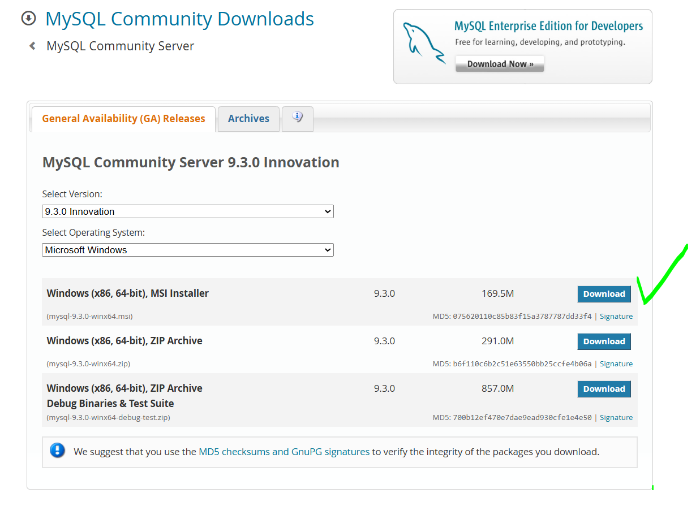
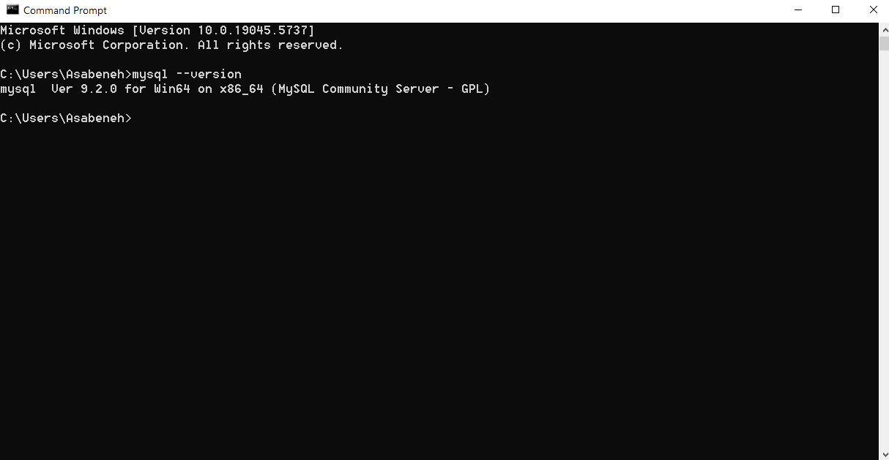
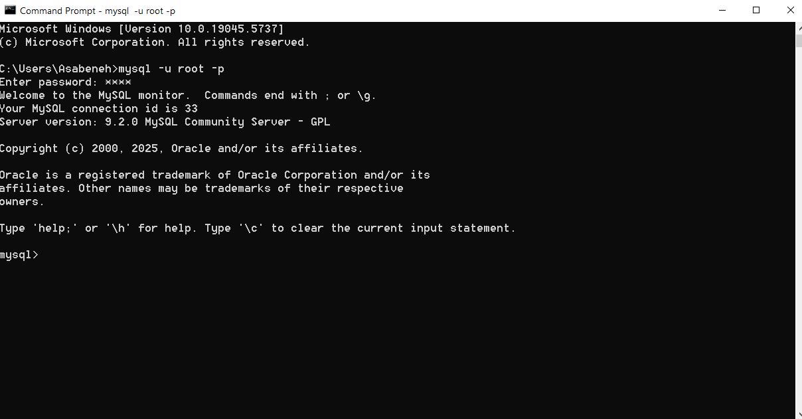
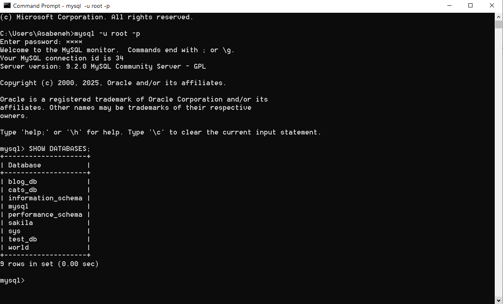

# Complete MySQL Lesson: Comprehensive Guide with Examples

This lesson provides a thorough and comprehensive introduction to MySQL, an open-source relational database management system (RDBMS). It builds on the previous lessons, incorporating all requested topics, including operators, advanced querying techniques, null handling, joins, aggregations, and more. Each section includes detailed explanations and practical examples using a `school` database. This is the complete, updated version of the lesson, designed to be a standalone resource for learning MySQL.

---

## 1. Introduction to MySQL

MySQL is a widely-used RDBMS that organizes data into tables with rows and columns. It uses Structured Query Language (SQL) to create, manage, and query databases. MySQL is popular for web applications, data analytics, and enterprise solutions due to its reliability, scalability, and ease of use.

---

## 2. Setting Up MySQL

To follow this lesson, install MySQL from mysql.com. Use a MySQL client like MySQL Workbench, phpMyAdmin, or the command-line interface.

In this lesson, we will use MySQL Community Server and you can download from this [link](https://dev.mysql.com/downloads/mysql/). You can downolad the latest version which is the selected by default.



## Check the version on Command prompt

You can check MySQL version, by writing ```mysql --version``` on the Windows command prompt on the termianl of Linux or MacOS.



### Connecting to MySQL

The following command on the command line will ask you to enter the passowrd, after entering the password and if you succedd, it should open MySQL Command-Line Client or MySQL Monitor.

```sql
mysql -u root -p
```

Enter your password to connect.


As you can see from the above image, the MySQL Monitor is open. We can write a query on the MySQL Command Line Client or Monitor.

Great question! Let’s break it down in simple terms:

---

### 🗂 What is a **Database**?

A **database** is like a digital **filing cabinet** — it stores and organizes data so it can be easily accessed, managed, and updated. In MySQL (and other relational databases), a database holds one or more **tables**, along with other structures like views, indexes, and stored procedures.

Think of a **database** as a **container** that holds everything related to a particular topic or system.

👉 For example:

- A **school** database might contain tables for students, teachers, courses, and grades.
- A **blog** database might have tables for users, posts, and comments.

---

### 📋 What is a **Table**?

A **table** is like a **spreadsheet** inside the database. It consists of rows and columns:

- **Columns** represent different pieces of information (fields).
- **Rows** represent individual records or entries.

👉 Example: A `students` table might look like this:

| id | name        | age | grade |
|----|-------------|-----|-------|
| 1  | Sarah Smith | 15  | 9     |
| 2  | John Lee    | 16  | 10    |

In this example:

- The **table name** is `students`.
- The **columns** are `id`, `name`, `age`, and `grade`. Each column has a data type.
- Each **row** is one student's data.

---

#### ✅ What is a Data Type?

A **data type** defines the kind of **data** a column can hold. It tells the database:

- What type of value is allowed in that column (e.g., numbers, text, dates),
- How much space it might need,
- And what kind of operations can be performed on it.

---

##### 🔹 Common MySQL Data Types

Here are some frequently used ones:

###### 🔢 Numbers

- `INT` – Whole numbers (e.g., 1, 25, -100)
- `FLOAT` / `DOUBLE` – Decimal numbers (e.g., 3.14, 100.5)

###### 🔤 Text

- `CHAR(n)` – Fixed-length text. Always stores exactly n characters. If you insert fewer characters, it will pad with spaces.
  - Example: CHAR(5) will store 'abc ' if you insert 'abc'.
  - Good for fields where all entries have the same length, like country codes ('USA', 'FIN', 'ETH').
- `VARCHAR(n)` – Variable-length text (e.g., names, emails). You specify a max length, like `VARCHAR(100)`.
- `TEXT` – Longer text (e.g., blog content, descriptions)

###### 📅 Dates and Times

- `DATE` – Stores a date (e.g., `2025-04-17`)
- `DATETIME` – Stores date and time (e.g., `2025-04-17 14:30:00`)
- `TIME` – Stores only time (e.g., `14:30:00`)

###### ✅ Others

- `BOOLEAN` or `TINYINT(1)` – For true/false values
- `ENUM` – A predefined list of allowed values (e.g., `ENUM('small', 'medium', 'large')`)

---

### 🔍 Example

```sql
CREATE TABLE students (
  id INT,
  name VARCHAR(100),
  age INT,
  enrolled_date DATE
);
```

- `id` and `age` are integers,
- `name` is a string up to 100 characters,
- `enrolled_date` is a date.

---

### Check existing Databases

We can write the ```SHOW DATABASES;``` query on the MySQL Command Line Clinet and this command willl display all the existing databases.



Below is a description of each database returned by the `SHOW DATABASES;` query:

---

#### 🔧 System Databases

| Database Name        | Description |
|----------------------|-------------|
| `information_schema` | A virtual database providing metadata about all databases, tables, columns, indexes, and more. |
| `mysql`              | Core system database storing user accounts, privileges, and configuration settings. |
| `performance_schema` | Monitors server performance — tracks query execution, resource usage, etc. |
| `sys`                | Friendly views built on top of `performance_schema` for easier monitoring and diagnostics. |

---

#### 📚 Sample / Example Databases

| Database Name | Description |
|---------------|-------------|
| `sakila`      | Sample DVD rental database. Includes data on customers, staff, payments, and inventory. |
| `world`       | Sample database with data about countries, cities, and languages. |
| `test_db`     | A test or experimental database, often used for practice or temporary data. |
| `cats_db`     | A custom database likely related to cat data — content varies depending on user design. |

---

#### 📝 User-Created Database

| Database Name | Description |
|---------------|-------------|
| `blog_db`     | A custom database likely built for a blog application. Could include tables like `posts`, `users`, `comments`, etc. |

---

#### ✅ Summary Table

| Database Name        | Type        | Description |
|----------------------|-------------|-------------|
| `information_schema` | System      | Metadata about databases/tables/columns. |
| `mysql`              | System      | User accounts and server configuration. |
| `performance_schema` | System      | Server performance monitoring. |
| `sys`                | System      | Simplified performance views. |
| `sakila`             | Sample      | DVD rental sample database. |
| `world`              | Sample      | Countries, cities, and languages sample. |
| `test_db`            | User/Test   | Test/experimental database. |
| `cats_db`            | User/Test   | Custom cat-related database. |
| `blog_db`            | User        | Custom blog application database. |

### Creating Database

Let us create a database called ```school``` using the following query:

```sql
CREATE DATABASE school;
USE school;
```


The school database has been created but it doesn't have any tables yet.


So in summary, the school database has been successfully created, but it doesn't contain any tables yet. This means it's currently an empty structure, ready for us to add tables such as students, teachers, courses, or anything else needed to represent the data for a school system.

On the other hand, the world database already contains three tables: city, country, and countrylanguage. These tables are part of a sample dataset commonly used in MySQL tutorials and demos. They provide real-world geographical data and are great for practicing SQL queries such as joins, filtering, grouping, and more. This makes the world database a useful resource for learning and experimentation.

### Creating Tables

We'll use three tables: `students`, `courses`, and `courses` (a junction table for many-to-many relationships).

```sql
CREATE TABLE students (
    id INT AUTO_INCREMENT PRIMARY KEY,
    first_name VARCHAR(50) NOT NULL,
    last_name VARCHAR(50) NOT NULL,
    birth_date DATE,
    grade_level INT,
    gpa DECIMAL(3,2),
    email VARCHAR(100)
);

CREATE TABLE courses (
    course_id INT AUTO_INCREMENT PRIMARY KEY,
    course_name VARCHAR(100) NOT NULL,
    teacher VARCHAR(50),
    credits INT
);

CREATE TABLE courses (
    student_id INT,
    course_id INT,
    enrollment_date DATE,
    PRIMARY KEY (student_id, course_id),
    FOREIGN KEY (student_id) REFERENCES students(id),
    FOREIGN KEY (course_id) REFERENCES courses(course_id)
);
```

### Inserting Sample Data

```sql
INSERT INTO students (first_name, last_name, birth_date, grade_level, gpa, email)
VALUES
    ('John', 'Doe', '2010-05-15', 9, 3.5, 'john.doe@example.com'),
    ('Jane', 'Smith', '2011-03-22', 8, 4.0, 'jane.smith@example.com'),
    ('Alice', 'Johnson', '2009-11-10', 10, NULL, NULL),
    ('Bob', 'Brown', '2010-07-01', 9, 2.8, 'bob.brown@example.com'),
    ('Emma', 'Wilson', '2009-09-05', 10, 3.9, 'emma.wilson@example.com');

INSERT INTO courses (course_name, teacher, credits)
VALUES
    ('Mathematics', 'Mr. Brown', 3),
    ('English', 'Ms. Green', 2),
    ('Science', NULL, 3),
    ('History', 'Mr. Adams', 2);

INSERT INTO student_courses (student_id, course_id, enrollment_date)
VALUES
    (1, 1, '2025-01-10'), -- John in Mathematics
    (1, 2, '2025-01-10'), -- John in English
    (2, 1, '2025-01-10'), -- Jane in Mathematics
    (2, 2, '2025-01-10'), -- Jane in English
    (3, 1, '2025-01-10'), -- Alice in Mathematics
    (4, 3, '2025-01-10'), -- Bob in Science
    (5, 1, '2025-01-10'), -- Emma in Mathematics
    (5, 4, '2025-01-10'); -- Emma in History
```

---

## 3. Basic CRUD Operations

### Create (INSERT)

Add a new student:

```sql
INSERT INTO students (first_name, last_name, grade_level, gpa, email)
VALUES ('Liam', 'Davis', 8, 3.2, 'liam.davis@example.com');
```

### Read (SELECT)

Retrieve all students:

```sql
SELECT * FROM students;
```

### Update

Update John's GPA:

```sql
UPDATE students
SET gpa = 3.6
WHERE first_name = 'John' AND last_name = 'Doe';
```

### Delete

Remove Bob Brown:

```sql
DELETE FROM students
WHERE first_name = 'Bob' AND last_name = 'Brown';
```

---

## 4. MySQL Operators

Operators enable comparisons, arithmetic, and logical operations.

### Arithmetic Operators

- `+`, `-`, `*`, `/`, `%` (modulus)

```sql
SELECT first_name, grade_level, grade_level + 1 AS next_grade
FROM students;
```

**Output:**

```sh
+------------+-------------+------------+
| first_name | grade_level | next_grade |
+------------+-------------+------------+
| John       | 9           | 10         |
| Jane       | 8           | 9          |
| Alice      | 10          | 11         |
| Bob        | 9           | 10         |
| Emma       | 10          | 11         |
+------------+-------------+------------+
```

### Comparison Operators

- `=`, `!=` or `<>`, `<`, `>`, `<=`, `>=`

```sql
SELECT first_name, gpa
FROM students
WHERE gpa > 3.5;
```

**Output:**

```sh
+------------+------+
| first_name | gpa  |
+------------+------+
| Jane       | 4.00 |
| Emma       | 3.90 |
+------------+------+
```

### Logical Operators

- `AND`, `OR`, `NOT`

```sql
SELECT first_name, grade_level, gpa
FROM students
WHERE grade_level = 9 AND gpa IS NOT NULL;
```

**Output:**

```sh
+------------+-------------+------ zwaar
| first_name | grade_level | gpa  |
+------------+-------------+------+
| John       | 9           | 3.60 |
| Bob        | 9           | 2.80 |
+------------+-------------+------+
```

---

## 5. ORDER BY

Sorts query results. Use `ASC` (ascending, default) or `DESC` (descending).

```sql
SELECT first_name, last_name, gpa
FROM students
ORDER BY gpa DESC, first_name ASC;
```

**Output:**

```sh
+------------+-----------+------+
| first_name | last_name | gpa  |
+------------+-----------+------+
| Jane       | Smith     | 4.00 |
| Emma       | Wilson    | 3.90 |
| John       | Doe       | 3.60 |
| Bob        | Brown     | 2.80 |
| Alice      | Johnson   | NULL |
+------------+-----------+------+
```

---

## 6. Handling NULL Values

`NULL` indicates missing or unknown data.

### Check for NULL

Use `IS NULL` or `IS NOT NULL`.

```sql
SELECT first_name, email
FROM students
WHERE email IS NULL;
```

**Output:**

```sh
+------------+-------+
| first_name | email |
+------------+-------+
| Alice      | NULL  |
+------------+-------+
```

### NULL Functions

- `IFNULL(column, default)`: Replaces NULL with a default value.
- `COALESCE(column1, column2, ...)`: Returns the first non-NULL value.

```sql
SELECT first_name, IFNULL(gpa, 0.0) AS adjusted_gpa, COALESCE(email, 'no_email@example.com') AS contact_email
FROM students;
```

**Output:**

```sh
+------------+--------------+-----------------------+
| first_name | adjusted_gpa | contact_email         |
+------------+--------------+-----------------------+
| John       | 3.60         | john.doe@example.com  |
| Jane       | 4.00         | jane.smith@example.com|
| Alice      | 0.00         | no_email@example.com  |
| Bob        | 2.80         | bob.brown@example.com |
| Emma       | 3.90         | emma.wilson@example.com|
+------------+--------------+-----------------------+
```

---

## 7. LIMIT

Restricts the number of rows returned. Optionally, use `OFFSET` to skip rows.

```sql
SELECT first_name, last_name
FROM students
ORDER BY first_name
LIMIT 2 OFFSET 1;
```

**Output:**

```sh
+------------+-----------+
| first_name | last_name |
+------------+-----------+
| Bob        | Brown     |
| Emma       | Wilson    |
+------------+-----------+
```

---

## 8. Aggregate Functions

Aggregate functions compute values across a set of rows.

### MIN, MAX

```sql
SELECT MIN(gpa) AS lowest_gpa, MAX(gpa) AS highest_gpa
FROM students;
```

**Output:**

```sh
+------------+-------------+
| lowest_gpa | highest_gpa |
+------------+-------------+
| 2.80       | 4.00        |
+------------+-------------+
```

### COUNT

```sql
SELECT COUNT(*) AS total_students, COUNT(gpa) AS students_with_gpa
FROM students;
```

**Output:**

```sh
+----------------+------------------+
| total_students | students_with_gpa |
+----------------+------------------+
| 5              | 4                |
+----------------+------------------+
```

### AVG, SUM

```sql
SELECT AVG(gpa) AS average_gpa, SUM(credits) AS total_credits
FROM students s
JOIN student_courses sc ON s.id = sc.student_id
JOIN courses c ON sc.course_id = c.course_id;
```

**Output:**

```sh
+-------------+---------------+
| average_gpa | total_credits |
+-------------+---------------+
| 3.7500      | 22            |
+-------------+---------------+
```

---

## 9. LIKE and Wildcards

The `LIKE` operator matches patterns.

- `%`: Any sequence of characters.
- `_`: A single character.

```sql
SELECT first_name, last_name
FROM students
WHERE last_name LIKE 'S%';
```

**Output:**

```sh
+------------+-----------+
| first_name | last_name |
+------------+-----------+
| Jane       | Smith     |
+------------+-----------+
```

```sql
SELECT first_name, email
FROM students
WHERE email LIKE '_o%@example.com';
```

**Output:**

```sh
+------------+----------------------+
| first_name | email                |
+------------+----------------------+
| John       | john.doe@example.com |
| Bob        | bob.brown@example.com|
+------------+----------------------+
```

---

## 10. IN, BETWEEN

- `IN`: Matches any value in a list.
- `BETWEEN`: Matches a range (inclusive).

```sql
SELECT first_name, grade_level
FROM students
WHERE grade_level IN (8, 10);
```

**Output:**

```sh
+------------+-------------+
| first_name | grade_level |
+------------+-------------+
| Jane       | 8           |
| Alice      | 10          |
| Emma       | 10          |
+------------+-------------+
```

```sql
SELECT first_name, birth_date
FROM students
WHERE birth_date BETWEEN '2010-01-01' AND '2011-12-31';
```

**Output:**

```sh
+------------+------------+
| first_name | birth_date |
+------------+------------+
| John       | 2010-05-15 |
| Jane       | 2011-03-22 |
| Bob        | 2010-07-01 |
+------------+------------+
```

---

## 11. Aliases

Aliases provide temporary names for columns or tables.

```sql
SELECT s.first_name AS fname, c.course_name AS subject
FROM students AS s
JOIN student_courses sc ON s.id = sc.student_id
JOIN courses c ON sc.course_id = c.course_id;
```

**Output:**

```sh
+-------+-------------+
| fname | subject     |
+-------+-------------+
| John  | Mathematics |
| John  | English     |
| Jane  | Mathematics |
| Jane  | English     |
| Alice | Mathematics |
| Bob   | Science     |
| Emma  | Mathematics |
| Emma  | History     |
+-------+-------------+
```

---

## 12. JOIN

Joins combine data from multiple tables.

### INNER JOIN

Returns only matching rows.

```sql
SELECT s.first_name, c.course_name, c.teacher
FROM students s
INNER JOIN student_courses sc ON s.id = sc.student_id
INNER JOIN courses c ON sc.course_id = c.course_id;
```

**Output:**

```sh
+------------+-------------+-----------+
| first_name | course_name | teacher   |
+------------+-------------+-----------+
| John       | Mathematics | Mr. Brown |
| John       | English     | Ms. Green |
| Jane       | Mathematics | Mr. Brown |
| Jane       | English     | Ms. Green |
| Alice      | Mathematics | Mr. Brown |
| Bob        | Science     | NULL      |
| Emma       | Mathematics | Mr. Brown |
| Emma       | History     | Mr. Adams |
+------------+-------------+-----------+
```

### LEFT JOIN

Includes all rows from the left table, with NULLs for non-matches.

```sql
SELECT c.course_name, COUNT(sc.student_id) AS student_count
FROM courses c
LEFT JOIN student_courses sc ON c.course_id = sc.course_id
GROUP BY c.course_name;
```

**Output:**

```sh
+-------------+---------------+
| course_name | student_count |
+-------------+---------------+
| Mathematics | 4             |
| English     | 2             |
| Science     | 1             |
| History     | 1             |
+-------------+---------------+
```

### RIGHT JOIN

Includes all rows from the right table.

```sql
SELECT s.first_name, c.course_name
FROM students s
RIGHT JOIN student_courses sc ON s.id = sc.student_id
RIGHT JOIN courses c ON sc.course_id = c.course_id;
```

**Output:**

```sh
+------------+-------------+
| first_name | course_name |
+------------+-------------+
| John       | Mathematics |
| Jane       | Mathematics |
| Alice      | Mathematics |
| Emma       | Mathematics |
| John       | English     |
| Jane       | English     |
| Bob        | Science     |
| Emma       | History     |
+------------+-------------+
```

---

## 13. UNION

Combines results from multiple `SELECT` statements, removing duplicates. Use `UNION ALL` to keep duplicates.

```sql
SELECT first_name AS name FROM students
UNION
SELECT teacher AS name FROM courses
ORDER BY name;
```

**Output:**

```sh
+--------------+
| name         |
+--------------+
| Alice        |
| Bob          |
| Emma         |
| Jane         |
| John         |
| Mr. Adams    |
| Mr. Brown    |
| Ms. Green    |
| NULL         |
+--------------+
```

---

## 14. GROUP BY

Groups rows with the same values into summary rows.

```sql
SELECT grade_level, COUNT(*) AS student_count, AVG(gpa) AS avg_gpa
FROM students
GROUP BY grade_level;
```

**Output:**

```sh
+-------------+---------------+---------+
| grade_level | student_count | avg_gpa |
+-------------+---------------+---------+
| 8           | 1             | 4.0000  |
| 9           | 2             | 3.2000  |
| 10          | 2             | 3.9000  |
+-------------+---------------+---------+
```

---

## 15. HAVING

Filters grouped results.

```sql
SELECT c.course_name, COUNT(sc.student_id) AS student_count
FROM courses c
LEFT JOIN student_courses sc ON c.course_id = sc.course_id
GROUP BY c.course_name
HAVING student_count > 2;
```

**Output:**

```sh
+-------------+---------------+
| course_name | student_count |
+-------------+---------------+
| Mathematics | 4             |
+-------------+---------------+
```

---

## 16. EXISTS

Checks if a subquery returns any rows.

```sql
SELECT first_name, last_name
FROM students s
WHERE EXISTS (
    SELECT 1
    FROM student_courses sc
    JOIN courses c ON sc.course_id = c.course_id
    WHERE sc.student_id = s.id AND c.course_name = 'English'
);
```

**Output:**

```sh
+------------+-----------+
| first_name | last_name |
+------------+-----------+
| John       | Doe       |
| Jane       | Smith     |
+------------+-----------+
```

---

## 17. ANY, ALL

- `ANY`: True if any subquery value meets the condition.
- `ALL`: True if all subquery values meet the condition.

```sql
SELECT first_name, gpa
FROM students
WHERE gpa > ANY (SELECT gpa FROM students WHERE grade_level = 9);
```

**Output:**

```sh
+------------+------+
| first_name | gpa  |
+------------+------+
| John       | 3.60 |
| Jane       | 4.00 |
| Emma       | 3.90 |
+------------+------+
```

```sql
SELECT first_name, gpa
FROM students
WHERE gpa > ALL (SELECT gpa FROM students WHERE grade_level = 9);
```

**Output:**

```sh
+------------+------+
| first_name | gpa  |
+------------+------+
| Jane       | 4.00 |
| Emma       | 3.90 |
+------------+------+
```

---

## 18. Comments

Comments improve code readability. Use `--` for single-line or `/* */` for multi-line.

```sql
-- Select students with high GPA
SELECT first_name, gpa
FROM students
WHERE gpa > 3.5;

/* Multi-line comment
   This query joins students and courses
   to show enrollment details */
SELECT s.first_name, c.course_name
FROM students s
JOIN student_courses sc ON s.id = sc.student_id
JOIN courses c ON sc.course_id = c.course_id;
```

---

## 19. Advanced Query Techniques

### Subqueries

Subqueries are queries nested within another query.

```sql
SELECT first_name, gpa
FROM students
WHERE gpa > (SELECT AVG(gpa) FROM students);
```

**Output:**

```sh
+------------+------+
| first_name | gpa  |
+------------+------+
| John       | 3.60 |
| Jane       | 4.00 |
| Emma       | 3.90 |
+------------+------+
```

### Common Table Expressions (CTEs)

CTEs simplify complex queries.

```sql
WITH StudentCourses AS (
    SELECT s.first_name, c.course_name
    FROM students s
    JOIN student_courses sc ON s.id = sc.student_id
    JOIN courses c ON sc.course_id = c.course_id
)
SELECT first_name, COUNT(*) AS course_count
FROM StudentCourses
GROUP BY first_name;
```

**Output:**

```sh
+------------+--------------+
| first_name | course_count |
+------------+--------------+
| John       | 2            |
| Jane       | 2            |
| Alice      | 1            |
| Bob        | 1            |
| Emma       | 2            |
+------------+--------------+
```

---

## 20. Database Management

### Indexes

Indexes improve query performance.

```sql
CREATE INDEX idx_grade_level ON students(grade_level);
```

### Dropping Tables/Databases

```sql
DROP TABLE student_courses;
DROP TABLE students;
DROP TABLE courses;
DROP DATABASE school;
```

**Note**: Use `DROP` cautiously, as it permanently deletes data.

---

## 21. Best Practices

- **Naming**: Use clear, descriptive names (e.g., `students` instead of `tbl1`).
- **Constraints**: Enforce data integrity with `PRIMARY KEY`, `FOREIGN KEY`, `NOT NULL`.
- **Indexes**: Add indexes for frequently queried columns.
- **Backups**: Regularly back up databases.
- **Query Optimization**: Test queries on small datasets and analyze performance with `EXPLAIN`.

---

## 22. Practice Exercise

Create a `library` database and perform various operations.

1. Create a `books` table (`id`, `title`, `author`, `publish_year`, `price`, `genre`).
2. Insert 6 books, including some with NULL values.
3. Write queries to:
   - Find books published between 2000 and 2020.
   - Count books per author, filtering for authors with more than one book.
   - Find titles containing "Code" using `LIKE`.
   - Replace NULL prices with 0 using `IFNULL`.
   - Use `IN` to find books in specific genres.
   - Use a `JOIN` to list books with their genres.
   - Use `EXISTS` to find authors with books after 2010.
   - Use `UNION` to combine book titles and author names.

### Solution

```sql
CREATE DATABASE library;
USE library;

CREATE TABLE books (
    id INT AUTO_INCREMENT PRIMARY KEY,
    title VARCHAR(100) NOT NULL,
    author VARCHAR(50) NOT NULL,
    publish_year INT,
    price DECIMAL(5,2),
    genre VARCHAR(50)
);

INSERT INTO books (title, author, publish_year, price, genre)
VALUES
    ('The Great Gatsby', 'F. Scott Fitzgerald', 1925, 10.99, 'Fiction'),
    ('Harry Potter', 'J.K. Rowling', 1997, 15.99, 'Fantasy'),
    ('The Da Vinci Code', 'Dan Brown', 2003, 12.50, 'Thriller'),
    ('Angels and Demons', 'Dan Brown', 2000, NULL, 'Thriller'),
    ('Chamber of Secrets', 'J.K. Rowling', 1998, 14.99, 'Fantasy'),
    ('Origin', 'Dan Brown', 2017, 13.99, 'Thriller');

-- Books between 2000 and 2020
SELECT title, publish_year
FROM books
WHERE publish_year BETWEEN 2000 AND 2020;

-- Count books per author, more than one book
SELECT author, COUNT(*) AS book_count
FROM books
GROUP BY author
HAVING book_count > 1;

-- Titles containing "Code"
SELECT title
FROM books
WHERE title LIKE '%Code%';

-- Replace NULL prices with 0
SELECT title, IFNULL(price, 0.0) AS adjusted_price
FROM books;

-- Books in specific genres
SELECT title, genre
FROM books
WHERE genre IN ('Fantasy', 'Thriller');

-- List books with genres (self-join for illustration)
SELECT b1.title, b1.genre
FROM books b1
JOIN books b2 ON b1.genre = b2.genre AND b1.id != b2.id;

-- Authors with books after 2010
SELECT author
FROM books b1
WHERE EXISTS (
    SELECT 1
    FROM books b2
    WHERE b2.author = b1.author AND b2.publish_year > 2010
);

-- UNION of titles and authors
SELECT title AS name FROM books
UNION
SELECT author AS name FROM books
ORDER BY name;
```

---
## 3. MySQL Data Types

A **data type** defines the kind of data a column can hold, specifying:

- The type of value allowed (e.g., numbers, text, dates).
- The storage space required.
- The operations that can be performed (e.g., arithmetic on numbers, string concatenation).

Choosing the appropriate data type ensures efficient storage, data integrity, and optimal query performance. Below is a comprehensive list of MySQL data types, organized by category, with descriptions and usage notes.

### 3.1 Numeric Data Types

For storing integers, decimals, and floating-point numbers.

- **TINYINT**: Very small integer. Range: -128 to 127 (0 to 255 for UNSIGNED). 1 byte. Example: `grade_level TINYINT`.
- **SMALLINT**: Small integer. Range: -32,768 to 32,767 (0 to 65,535 for UNSIGNED). 2 bytes. Example: `small_int SMALLINT`.
- **MEDIUMINT**: Medium-sized integer. Range: -8,388,608 to 8,388,607 (0 to 16,777,215 for UNSIGNED). 3 bytes.
- **INT (INTEGER)**: Standard integer. Range: -2,147,483,648 to 2,147,483,647 (0 to 4,294,967,295 for UNSIGNED). 4 bytes. Example: `id INT`.
- **BIGINT**: Large integer. Range: -9,223,372,036,854,775,808 to 9,223,372,036,854,775,807 (0 to 18,446,744,073,709,551,615 for UNSIGNED). 8 bytes.
- **DECIMAL (NUMERIC)**: Fixed-point number for exact decimals. Format: DECIMAL(M,D), where M is total digits, D is decimal places (e.g., DECIMAL(5,2) stores 123.45). Example: `gpa DECIMAL(3,2)`.
- **FLOAT**: Single-precision floating-point number. Approximate, 4 bytes. Suitable for small decimals. Example: `float_val FLOAT`.
- **DOUBLE (DOUBLE PRECISION)**: Double-precision floating-point number. Approximate, 8 bytes. For larger decimals.
- **BIT**: Stores bit values (0 or 1). Format: BIT(M), where M is bits (1 to 64). Example: `bit_val BIT(8)`.

**Note**: Use `UNSIGNED` for non-negative values to double the positive range. Use `DECIMAL` for exact values (e.g., currency), `FLOAT`/`DOUBLE` for approximate scientific calculations.

### 3.2 Date and Time Data Types

For storing temporal information.

- **DATE**: Stores date (YYYY-MM-DD). Range: '1000-01-01' to '9999-12-31'. Example: `birth_date DATE`.
- **TIME**: Stores time (HH:MM:SS). Range: '-838:59:59' to '838:59:59'.
- **DATETIME**: Stores date and time (YYYY-MM-DD HH:MM:SS). Range: '1000-01-01 00:00:00' to '9999-12-31 23:59:59'. Example: `datetime_val DATETIME`.
- **TIMESTAMP**: Stores date and time, auto-updates on insert/update. Range: '1970-01-01 00:00:01' UTC to '2038-01-19 03:14:07' UTC. Example: `timestamp_val TIMESTAMP`.
- **YEAR**: Stores year in 2-digit or 4-digit format. Range: 1901 to 2155 (or 70 to 69 for 2-digit, 1970-2069).

### 3.3 String (Character) Data Types

For storing text or binary data.

- **CHAR**: Fixed-length string (0 to 255 characters). Pads with spaces. Example: CHAR(10) stores 'abc' as 'abc '. Good for fixed-length data like country codes. Example: `char_val CHAR(10)`.
- **VARCHAR**: Variable-length string (0 to 65,535 characters). Stores actual length + 1-2 bytes. Example: `first_name VARCHAR(50)`.
- **BINARY**: Fixed-length binary data (0 to 255 bytes). Like CHAR but for bytes.
- **VARBINARY**: Variable-length binary data (0 to 65,535 bytes). Like VARCHAR but for binary data.
- **TINYTEXT**: Variable-length text (up to 255 characters). For short text.
- **TEXT**: Variable-length text (up to 65,535 characters). For longer text like paragraphs. Example: `text_val TEXT`.
- **MEDIUMTEXT**: Variable-length text (up to 16,777,215 characters). For large text.
- **LONGTEXT**: Variable-length text (up to 4,294,967,295 characters). For documents.
- **TINYBLOB**: Variable-length binary data (up to 255 bytes). For small binary objects.
- **BLOB**: Variable-length binary data (up to 65,535 bytes). For images.
- **MEDIUMBLOB**: Variable-length binary data (up to 16,777,215 bytes). For larger binary objects.
- **LONGBLOB**: Variable-length binary data (up to 4,294,967,295 bytes). For videos.
- **ENUM**: String from a predefined list (e.g., ENUM('small', 'medium', 'large')). Up to 65,535 values. Example: `enum_val ENUM('low', 'medium', 'high')`.
- **SET**: String with zero or more values from a predefined list (e.g., SET('red', 'blue', 'green')). Up to 64 values. Example: `set_val SET('read', 'write', 'execute')`.

**Note**: Use `CHAR` for fixed-length data, `VARCHAR` for variable-length text, and `TEXT` for large text. String types support character sets like UTF-8 for internationalization.

### 3.4 Spatial Data Types

For geometric and geographic data, used with spatial queries.

- **GEOMETRY**: Generic type for spatial data (points, lines, polygons).
- **POINT**: Single X,Y coordinate (e.g., location). Example: `point_val POINT`.
- **LINESTRING**: Sequence of points forming a line.
- **POLYGON**: Closed shape with multiple points.
- **MULTIPOINT**: Collection of points.
- **MULTILINESTRING**: Collection of linestrings.
- **MULTIPOLYGON**: Collection of polygons.
- **GEOMETRYCOLLECTION**: Collection of geometry objects.

**Note**: Requires MySQL’s spatial extensions and GIS functions.

### 3.5 JSON Data Type

- **JSON**: Stores JSON data (objects, arrays). Supports querying with functions like `JSON_EXTRACT`. Example: `json_val JSON`.

### 3.6 Boolean Data Type

- **BOOLEAN**: Stores true/false values. Internally uses `TINYINT(1)`, where 0 is false, 1 is true. Example: `is_active BOOLEAN`.

### 3.7 Example Table with Data Types

```sql
CREATE TABLE sample_data (
    id INT AUTO_INCREMENT PRIMARY KEY,
    tiny_int TINYINT UNSIGNED,
    small_int SMALLINT,
    medium_int MEDIUMINT,
    big_int BIGINT,
    decimal_val DECIMAL(10,2),
    float_val FLOAT,
    double_val DOUBLE,
    bit_val BIT(8),
    date_val DATE,
    time_val TIME,
    datetime_val DATETIME,
    timestamp_val TIMESTAMP DEFAULT CURRENT_TIMESTAMP,
    year_val YEAR,
    char_val CHAR(10),
    varchar_val VARCHAR(50),
    binary_val BINARY(10),
    varbinary_val VARBINARY(50),
    tinytext_val TINYTEXT,
    text_val TEXT,
    mediumtext_val MEDIUMTEXT,
    longtext_val LONGTEXT,
    tinyblob_val TINYBLOB,
    blob_val BLOB,
    mediumblob_val MEDIUMBLOB,
    longblob_val LONGBLOB,
    enum_val ENUM('low', 'medium', 'high'),
    set_val SET('read', 'write', 'execute'),
    point_val POINT,
    json_val JSON,
    is_active BOOLEAN
);
```

### Insert Example Data

```sql
INSERT INTO sample_data (
    tiny_int, small_int, medium_int, big_int, decimal_val, float_val, double_val, bit_val,
    date_val, time_val, datetime_val, year_val, char_val, varchar_val, binary_val, varbinary_val,
    tinytext_val, text_val, enum_val, set_val, point_val, json_val, is_active
)
VALUES (
    255, -32768, 8388607, 9223372036854775807, 123456.78, 3.14159, 2.718281828459, b'10101010',
    '2025-04-17', '14:30:00', '2025-04-17 14:30:00', 2025, 'fixed', 'variable length',
    0x48656C6C6F, 0x776F726C64, 'Short text', 'Longer text description', 'medium', 'read,write',
    POINT(10, 20), '{"name": "Sample", "value": 42}', TRUE
);
```

### 3.8 Data Type Usage Notes

- **UNSIGNED**: Use for non-negative numeric values to double the positive range.
- **Storage Optimization**: Choose the smallest data type (e.g., `TINYINT` vs. `INT`) to save space.
- **Precision**: Use `DECIMAL` for exact values (e.g., currency), `FLOAT`/`DOUBLE` for approximate calculations.
- **Character Sets**: String types support UTF-8 for internationalization.
- **Spatial Types**: Require spatial extensions for GIS applications.
- **JSON**: Ideal for semi-structured data with querying functions.
- **BOOLEAN**: Simplifies true/false logic, stored as `TINYINT(1)`.

This data type overview ensures you can design efficient database schemas tailored to your data needs.

---

## 23. Conclusion

This comprehensive MySQL lesson covers everything from basic CRUD operations to advanced querying techniques. By practicing these concepts and experimenting with your own databases, you'll gain proficiency in MySQL. Explore further topics like stored procedures, triggers, and transaction management for deeper learning.
